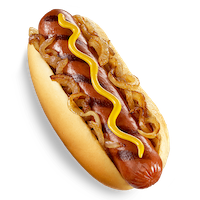
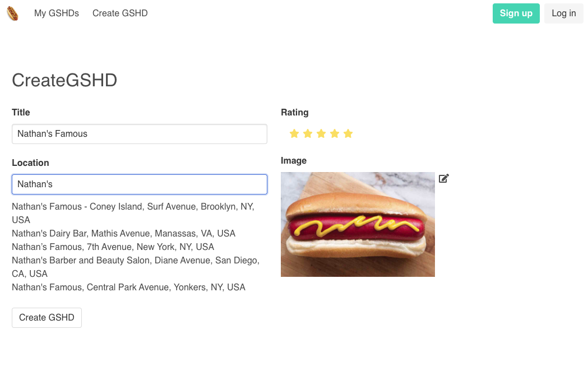

# GSHD

Welcome to *GSHD* (Gretzky-Style Hot Dog), a silly meal tracking application inspired by an iconic 2015 [Reddit post about Wayne Gretzky's Strange Eating Habits](https://www.reddit.com/r/hockey/comments/3e518u/wayne_gretzkys_strange_eating_habits/). To save you a click, Gretzky apparently always ate multiple hot dogs with mustard and onions before each and every game, among other quirks. Therefore, a hot dog with mustard and onions is considered "Gretzky-style".

*GSHD* allows users to log different GSHDs they've eaten around the world, saving information such as its location, a rating, and of course an image. In the app's current local MVP state, users can do just that. 

In its finished state, I hope that the GSHD app will become a network where GSHD lovers can contribute to a global database of delicious hot dogs they've eaten, share with each other, and make friends, and appreciate the GSHD. 

## Tech Stack

This app is built on the MERN stack. 

In the backend, it is running on:

* Node.js
* Express.js 
* MongoDB 
* Mongoose.js.
* AWS S3
* bcrypt
* Passport.js

On the frontend, it uses: 
 
* React.js
* Redux
* Axios for HTTP requests
* Bulma as a CSS framework
* SCSS
* *react-places-autocomplete* and *google-maps-react* to help with locations and map components. 

I am continuing to add new features and will be doubling back to refactor and improve the existing code as I go forward. 

## Authors

* **Josh Coles**

## License

This project is licensed under the MIT License.

## Screenshots

### List

### Create

### Edit
